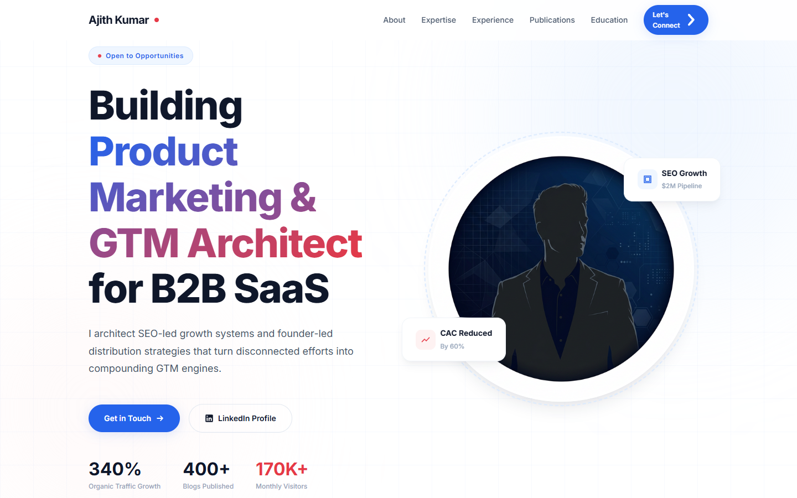

# Ajith Kumar M - Personal Portfolio



Welcome to the personal portfolio of **Ajith Kumar M**, a Product Marketing & GTM Architect building SEO-led growth and founder-led distribution for B2B SaaS.

## 🚀 Overview

This repository contains the source code for a highly responsive, modern, and accessible personal portfolio website. It highlights professional experience, core expertise, published work, and awards. 

The design is built focusing on:
- **High Performance:** Lightweight assets and vanilla web technologies.
- **Accessibility:** Semantic HTML and ARIA roles for inclusive navigation.
- **Responsiveness:** Fluid grid layouts adapting seamlessly from mobile to desktop.
- **Modern UI/UX:** Glassmorphism, CSS variables-based theming, subtle animations, and scroll-triggered reveals.
## 📸 Screenshots

### Desktop View


### Mobile View


## ✨ Features

- **Hero Section:** Engaging introduction with animated stats, typing effects, and floating metric cards.
- **About & Expertise:** Grid layouts detailing core skills, strategic GTM focus, and SEO capabilities.
- **Impact Metrics:** Data-driven achievements highlighted with dynamic counters.
- **Experience Timeline:** A chronological overview of professional background and key responsibilities.
- **Publications & Awards:** Dedicated sections for thought leadership articles and industry recognitions.
- **Contact Form:** Functional and validated form to reach out directly.
- **Responsive Navigation:** Sticky header with a mobile-friendly hamburger menu.

## 🛠️ Built With

- **HTML5:** Semantic structure and SEO-friendly tags.
- **CSS3 (Vanilla):** Flexbox, CSS Grid, Custom Properties (Variables), and Keyframe Animations.
- **JavaScript (Vanilla):** DOM manipulation, Intersection Observers for scroll animations, and dynamic counters.

## 🔧 Installation & Setup

Since this is a static website built with vanilla HTML, CSS, and JS, no complex build tools or dependencies are required.

### 1. Clone the repository
```bash
git clone https://github.com/ajitharunai/Ajith-Kumar_M_Personal-Portfolio.git
```

### 2. Navigate to the project directory
```bash
cd Ajith-Kumar_M_Personal-Portfolio
```

### 3. Serve the application
You can use any local web server to serve the files. 

**Using VS Code:**
Install the [Live Server](https://marketplace.visualstudio.com/items?itemName=ritwickdey.LiveServer) extension, right-click `index.html`, and select "Open with Live Server".

**Using Python:**
```bash
# Python 3
python -m http.server 8000
```
Then visit `http://localhost:8000` in your browser.

**Using Node.js (http-server):**
```bash
npx http-server
```

## 🎨 Customization

To personalize this portfolio for yourself, modify the following core files:

- **`index.html`:** Update the text content, links, meta descriptions, and image sources.
- **`styles.css`:** Adjust the CSS Variables (`:root`) at the top of the file to change the color scheme, typography, and spacing.
  ```css
  :root {
      --color-primary: #yourColor;
      --color-accent: #yourColor;
      --font-body: 'Your Font', sans-serif;
  }
  ```
- **`script.js`:** Modify typing text arrays or intersection observer thresholds if needed.
- **`assets/images/`:** Replace the profile pictures and icons with your own assets.

## 📄 License

This project is open-source and available under the [MIT License](LICENSE).

---
*Designed & Built for impact connecting growth to revenue.*
